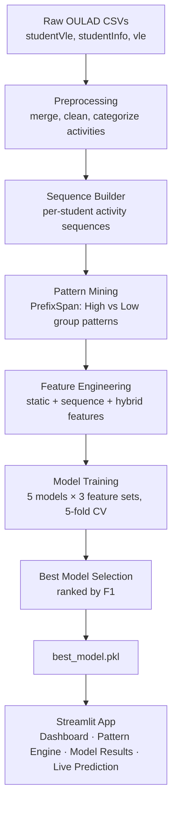

# 🎓 Student Performance Prediction — LMS Intelligence

Predicting student outcomes from LMS clickstream behavior using sequential pattern mining and ensemble machine learning.


---

## 📌 Overview

Online courses generate large volumes of clickstream data — but raw activity logs rarely tell instructors *which behavioral patterns* actually separate students who pass from students who struggle.

This project builds an end-to-end pipeline on the **OULAD (Open University Learning Analytics Dataset)** that:

1. Cleans and categorizes raw VLE (Virtual Learning Environment) interaction logs into behavioral categories (`StudyMaterial`, `Quiz`, `Discussion`, `External`, `Navigation`, `DataTool`).
2. Converts each student's activity history into a **behavioral sequence**.
3. Mines **discriminative sequential patterns** (via PrefixSpan) that occur significantly more often in high-performing vs. low-performing students.
4. Engineers **static** (aggregate) and **sequence-derived** (pattern-based) feature sets, and combines them into a **hybrid** feature set.
5. Trains and benchmarks 5 classifiers × 3 feature sets (15 combinations) to predict final student outcome (Pass/Fail).
6. Serves the best model through an interactive **Streamlit dashboard** for exploration and live prediction.

The goal is to move beyond simple engagement counts ("did the student click a lot?") toward **behavioral sequence intelligence** ("in what order did the student engage, and does that order predict success?").

---

## ✨ Key Features

- **Sequential pattern mining with PrefixSpan** — extracts frequent activity subsequences (e.g. `External → StudyMaterial → External → Discussion`) and ranks them by how discriminative they are between high- and low-performing student groups.
- **Hybrid feature engineering** — combines classic aggregate engagement metrics (total clicks, interaction counts per category, pre-course activity) with binary pattern-membership features derived from mined sequences.
- **Multi-model benchmarking framework** — a reusable evaluation harness (`src/models.py`) that runs Logistic Regression, Random Forest, XGBoost, LightGBM, and SVM across static, sequence, and hybrid feature sets with stratified 5-fold cross-validation.
- **Class-imbalance-aware training** — `class_weight="balanced"` / `scale_pos_weight` tuning across all models to handle the natural Pass/Fail imbalance in the dataset.
- **Production-style ML pipelines** — every model is wrapped in a `scikit-learn` `Pipeline` (scaler + classifier) and serialized with `pickle` for direct reuse in the serving app.
- **Interactive analytics dashboard** — a 4-page Streamlit app (Dashboard, Pattern Engine, Model Results, Live Prediction) with a custom dark-themed UI for exploring patterns and testing the model on hypothetical students.

---

## 🛠 Tech Stack

| Layer | Technology |
|---|---|
| Language | Python |
| Data Processing | pandas, NumPy |
| Sequential Pattern Mining | PrefixSpan |
| Machine Learning | scikit-learn, XGBoost, LightGBM |
| Visualization | Matplotlib, Seaborn, Plotly |
| App / Serving | Streamlit |
| Experimentation | Jupyter Notebooks |
| Reporting | python-docx |

---

## 🏗 Architecture / Workflow



---

## ⚙️ How It Works

1. **Preprocessing** (`src/preprocessing.py`) — merges `studentVle`, `studentInfo`, and `vle` tables, drops withdrawn students, maps raw OULAD `activity_type` values into 6 higher-level behavioral categories, and produces a clean, sorted interaction log.
2. **Sequence construction** (`src/sequence_builder.py`) — groups each student's chronological activity categories into a single comma-separated sequence and labels students `High` (Pass) or `Low` (Fail).
3. **Pattern mining** (`src/pattern_mining.py`) — runs PrefixSpan independently on the High and Low sequence groups, computes support percentages for each pattern in both groups, and selects the top discriminative patterns by support difference.
4. **Feature engineering** (`src/feature_engineering.py`) — builds:
   - **Static features**: total clicks, total interactions, unique activity types, pre-course interactions, and per-category interaction counts.
   - **Sequence features**: binary flags for whether a student's sequence contains each selected discriminative pattern.
   - **Hybrid features**: static + sequence combined.
5. **Model training** (`src/models.py`) — evaluates Logistic Regression, Random Forest, XGBoost, LightGBM, and SVM (each in a `StandardScaler` + classifier pipeline) across all three feature sets using stratified 5-fold cross-validation, then persists the top-ranked model + metadata to `results/best_model.pkl`.
6. **Serving** (`app/app.py`) — a Streamlit app loads the trained pipeline and exposes it through a dashboard for pattern exploration, model comparison, and live what-if predictions on manually entered student engagement values.

---

## 📊 Results / Performance

Benchmarked with stratified 5-fold cross-validation across 5 models × 3 feature sets (15 total runs). Full results in [`results/model_results.csv`](results/model_results.csv).

**Best model: Random Forest — Hybrid features**

| Metric | Score |
|---|---|
| Accuracy | 0.8312 |
| Precision | 0.8301 |
| Recall | 0.8312 |
| F1 Score | 0.8222 |

**Top results across models (hybrid & static feature sets):**

| Model | Feature Set | Accuracy | F1 |
|---|---|---|---|
| Random Forest | Hybrid | 0.8312 | 0.8222 |
| Random Forest | Static | 0.8302 | 0.8211 |
| XGBoost | Static | 0.8244 | 0.8062 |
| LightGBM | Hybrid | 0.8126 | 0.8119 |
| SVM | Static | 0.7970 | 0.7981 |

Sequence-only pattern features underperform static/hybrid sets across all models — engagement volume remains the strongest static signal, while mined sequential patterns provide a smaller, complementary lift when combined with it.

---

## 📁 Project Structure

```
Student-Performance-Prediction/
├── app/
│   ├── app.py                  # Streamlit entry point
│   ├── utils.py
│   └── components/              # Dashboard, Pattern Engine, Model Results, Prediction pages
├── data/
│   ├── raw/                    # OULAD source CSVs (not committed)
│   └── processed/              # Cleaned logs, sequences, feature matrix
├── notebooks/
│   ├── data_exploration.ipynb
│   ├── preprocessing.ipynb
│   ├── sequence_construction.ipynb
│   ├── pattern_mining.ipynb
│   ├── feature_generation.ipynb
│   └── model_training.ipynb
├── src/
│   ├── preprocessing.py
│   ├── sequence_builder.py
│   ├── pattern_mining.py
│   ├── prefixspan.py
│   ├── feature_engineering.py
│   ├── models.py
│   └── visualize_extras.py
├── results/
│   ├── best_model.pkl
│   ├── best_model_info.csv
│   ├── model_results.csv
│   ├── patterns.csv
│   ├── selected_patterns.csv
│   └── figures/
├── report/
│   └── final_report.docx
└── requirements.txt
```

---

## 🚀 Installation & Usage

### Prerequisites
- Python 3.10+
- [OULAD dataset](https://analyse.kmi.open.ac.uk/open_dataset) CSVs (`studentVle.csv`, `studentInfo.csv`, `vle.csv`) placed in `data/raw/`

### Setup

```bash
# Clone the repository
git clone https://github.com/DharaniSowmiyan/Student-Performance-Prediction.git
cd Student-Performance-Prediction

# Install dependencies
pip install -r requirements.txt
```

### Run the pipeline

```bash
# [TODO] Add exact CLI/notebook run order if a pipeline entry-point script exists,
# e.g.:
# python -m src.preprocessing
# python -m src.sequence_builder
# python -m src.pattern_mining
# python -m src.feature_engineering
# python -m src.models
```

> Currently the pipeline stages are run via the notebooks in `notebooks/` in order: exploration → preprocessing → sequence construction → pattern mining → feature generation → model training.

### Launch the dashboard

```bash
streamlit run app/app.py
```

---

## 🖼 Screenshots / Demo

| Dashboard | Pattern Engine |
|---|---|
| `[TODO: screenshot]` | `[TODO: screenshot]` |

| Model Results | Live Prediction |
|---|---|
| `[TODO: screenshot]` | `[TODO: screenshot]` |

`[TODO: add live demo link if deployed, e.g. Streamlit Community Cloud]`

---

## 🔭 Future Improvements

- [TODO] Add temporal/deep-sequence models (e.g. LSTM/Transformer on raw sequences) as a comparison baseline against pattern-mined features.
- [TODO] Extend pattern mining to multi-class outcomes (Distinction / Pass / Fail / Withdrawn) instead of the current binary High/Low grouping.
- [TODO] Add SHAP-based explainability for individual predictions in the Live Prediction page.
- [TODO] Containerize the app (Docker) and add CI for automated retraining/evaluation.
- [TODO] Add unit tests for `src/` pipeline modules.

---

## 📄 License

`[TODO]`
